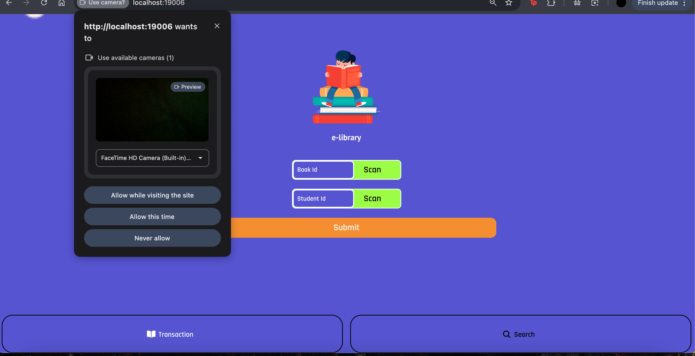

# 📚 e-Library website

A **mobile e-library app** built with **React Native + Expo** that allows users to browse, search, and read books.  
This project is part of the **C71** curriculum and demonstrates basic database integration, navigation, and user interaction.

---

## 📱 App Preview

| Home Screen | Scan Code |
|------------|------------|
|  |  |


---

## 🚀 Features

- 📱 Scan Book Code
- 📖 Browse list of books  
- 🔍 Search books by title/author  
- 📚 View book details  

---

## 🧠 Technologies Used

- **React Native** – for building the app  
- **Expo** – to manage and run the project  
- **React Navigation** – for screen navigation  
- **Firebase / Local JSON** – backend book data source  
- **JavaScript (ES6+)**

---

## 🛠️ Getting Started (Run Locally)

Clone the repository, install dependencies, and start the Expo development server using the commands below. Once the server starts, you can run the app on your phone, browser, or Android emulator.

```bash
git clone https://github.com/Sejal116/e-library-C71.git
cd e-library-C71
npm install
npx expo start

🛠️ Run it on app or web

📱 Mobile: Scan the QR code with Expo Go (Android / iOS)
🖥️ Web: Press w to open the app in a web browser
📱 Android Emulator: Press a to open the app (ensure it’s running)

